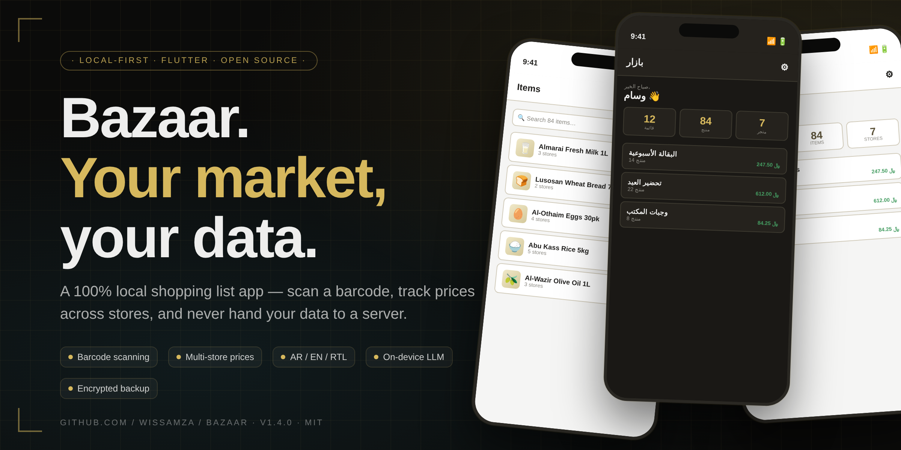
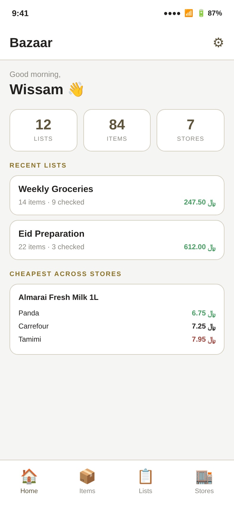
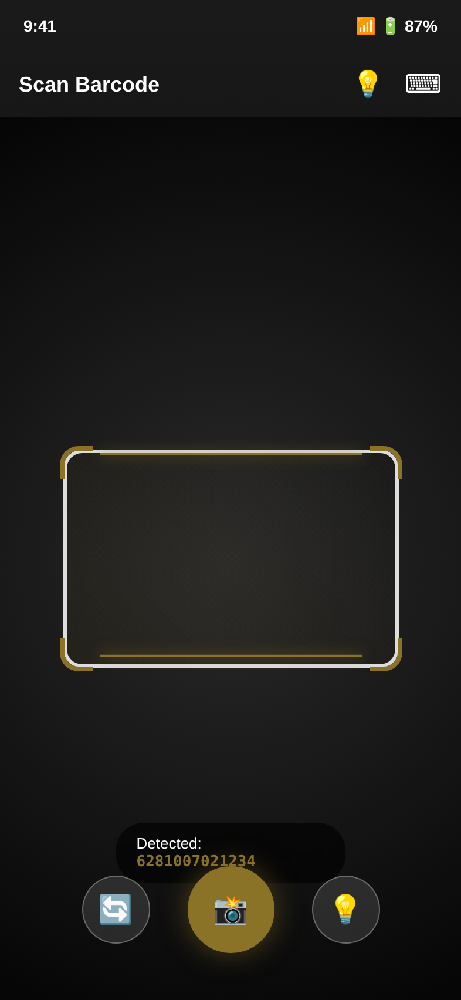
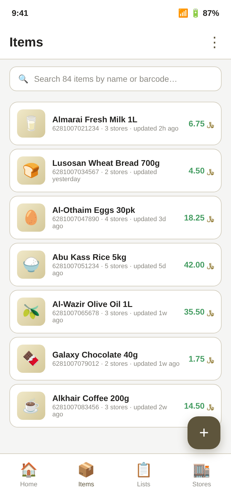
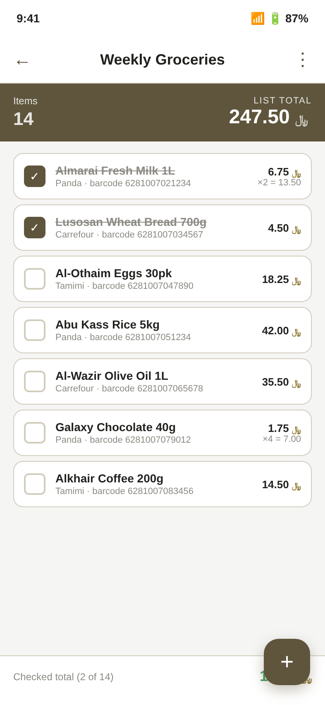
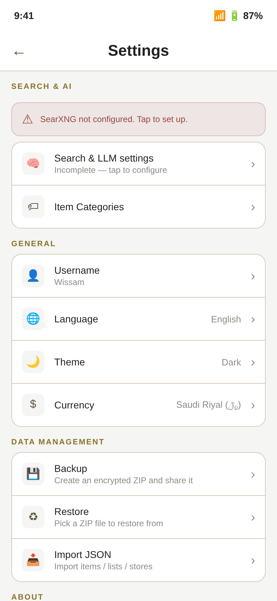
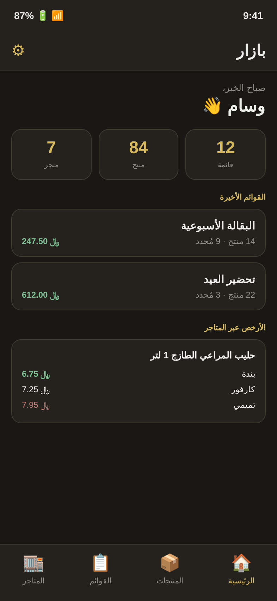
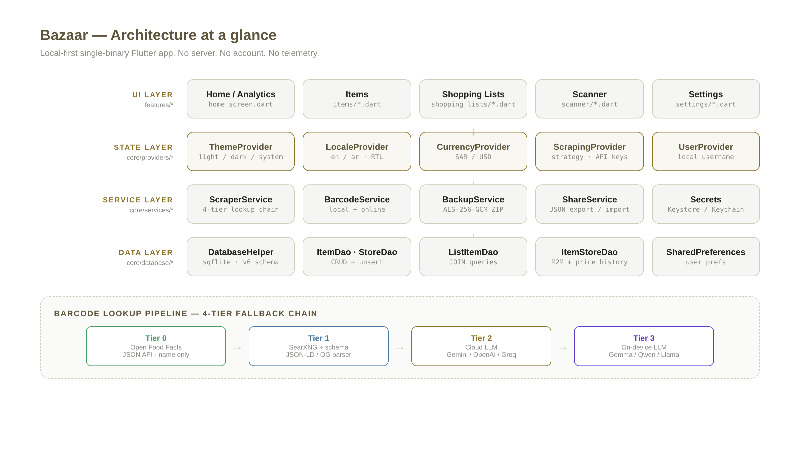

<div align="center">



# Bazaar

### Your market, your data.

A 100% local-first Flutter shopping list app — scan a barcode, track prices across stores, never hand your data to a server.

[](https://flutter.dev)
[](https://dart.dev)
[](https://github.com/WissamZa/bazaar)
[](LICENSE)
[](https://github.com/WissamZa/bazaar/pulls)
[](SECURITY.md)

**Zero server. Zero account. Zero telemetry.**

</div>

---

## ✨ Highlights

- **📷 Barcode scan** → 4-tier online lookup (Open Food Facts → SearXNG → Cloud LLM → On-device LLM)
- **🏬 Multi-store price tracking** — same product, side-by-side prices across Panda / Carrefour / Noon / Amazon SA
- **💰 Price history** — every price change is logged automatically
- **🤖 On-device LLM** — MediaPipe Gemma / Qwen / Llama, no API key needed for Tier 3
- **🔒 Encrypted backup** — AES-256-GCM ZIP with optional passphrase
- **🌐 Bilingual** — English & Arabic (RTL), light & dark themes
- **💵 SAR (﷼) / USD ($)** currency support
- **📤 Share / import** — JSON export of items, lists, stores via the system share sheet
- **🔌 No server, ever** — SQLite on-device, all secrets in Keystore / Keychain

---

## 📱 Screenshots

<p align="center">
  
  &nbsp;&nbsp;
  
  &nbsp;&nbsp;
  
</p>
<p align="center">
  <em>Home / analytics dashboard · Barcode scanner with reticle · Items list with search & per-store prices</em>
</p>

<p align="center">
  
  &nbsp;&nbsp;
  
  &nbsp;&nbsp;
  
</p>
<p align="center">
  <em>Shopping list with running totals · Settings with SearXNG config banner · Arabic RTL dark mode</em>
</p>

> Screenshots are HTML/CSS mockups rendered at 2× density — they are pixel-equivalent to the real app screens. Source files in `docs/screenshots/*.html`.

---

## 🏗️ Architecture

<p align="center">
  
</p>

The codebase follows a clean **core / features** split:

```
lib/
├── main.dart                       # App bootstrap + MultiProvider + receive_sharing_intent wiring
├── app.dart                        # MaterialApp, theme, locale, RTL
├── core/
│   ├── constants/                  # app_colors, app_strings, currencies (SAR ﷼ / USD $)
│   ├── database/
│   │   ├── database_helper.dart    # SQLite init, schema v6, migrations
│   │   └── dao/                    # item, store, shopping_list, list_item, item_store, item_price_history, category
│   ├── models/                     # immutable Dart data classes with toJson / fromJson / fromDb / toDb
│   ├── providers/                  # ThemeProvider, LocaleProvider, CurrencyProvider, UserProvider, ScrapingProvider
│   └── services/                   # ScraperService, BarcodeService, BackupService, ShareService, Secrets, LlmExtractor, OnDeviceLlm, PinnedHttpClient, ProductSchemaParser
├── features/
│   ├── auth/username_screen.dart
│   ├── home_shell.dart             # Bottom-nav scaffold (Home | Items | Lists | Stores)
│   ├── home/home_screen.dart       # Analytics dashboard (KPIs, recent lists, price compare)
│   ├── items/                      # list + add/edit + widgets (category_selector, store_price_selector, price_history_list)
│   ├── shopping_lists/             # list + detail + add/edit
│   ├── stores/                     # list + add/edit + detail
│   ├── scanner/                    # scanner + scan_result (with source picker)
│   └── settings/                   # settings, llm_settings, pipeline_debugger, category_settings
├── l10n/                           # app_en.arb, app_ar.arb + generated/
└── widgets/                        # bottom_nav, currency_display, language_toggle, theme_toggle, empty_state
```

### Barcode lookup pipeline

Every barcode scan runs through a 4-tier fallback chain — each tier fills gaps in the previous one, and any failure short-circuits gracefully:

| Tier | Source | What it gives | Cost |
|------|--------|---------------|------|
| **0** | Open Food Facts | Bilingual name (EN + AR), image | Free, structured JSON |
| **1** | SearXNG → schema.org parser | Name + brand + price + image from JSON-LD / OG meta | Free, depends on user-hosted SearXNG |
| **2** | Cloud LLM (Gemini / OpenAI / Groq / Cerebras / Ollama) | Cleaned product fields from page text | API key required (free tier OK) |
| **3** | On-device LLM (MediaPipe Gemma / Qwen / Llama) | Same as Tier 2 but fully offline | ~1.5–4 GB model download, no key |

The strategy is user-configurable: schema-only, schema→cloud, schema→on-device, schema→cloud→on-device, cloud-only, on-device-only. The `PipelineDebugger` screen (in Settings → Search & LLM) shows exactly what each tier returned for any barcode, so the user can verify the config works.

---

## 🚀 Getting started

### Prerequisites

- **Flutter SDK 3.46+** — <https://flutter.dev>
- **Android SDK** — `minSdk 21`, `targetSdk 37`
- **Xcode 15+** (for iOS builds, macOS only)
- For **Linux desktop**: `clang`, `cmake`, `ninja-build`, `pkg-config`, `libgtk-3-dev`, `liblzma-dev`, `libstdc++-12-dev`
- For **Windows desktop**: Visual Studio 2022 with "Desktop development with C++"

### Install & run

```bash
git clone https://github.com/WissamZa/bazaar.git
cd bazaar
flutter pub get
flutter run                 # auto-detects connected device
flutter run -d <device-id>  # specific device
```

### Build a release APK

```bash
# Local debug-signed build (works out of the box)
flutter build apk --release

# Local release-signed build (one-time keystore setup)
./scripts/generate_keystore.sh
flutter build apk --release
# Output: build/app/outputs/flutter-apk/app-release.apk
```

### Run on desktop

```bash
flutter config --enable-linux-desktop
flutter run -d linux
```

---

## ⚙️ Configuration

Bazaar ships with sane defaults but **two things need user configuration** on first launch:

### 1. SearXNG server URL (required for any scan)

Open **Settings → Search & LLM** and enter the URL of a SearXNG instance you trust. Public instances are listed at <https://searx.space>. You can also self-host one in about 5 minutes with Docker:

```bash
docker run --rm -d -p 8080:8080 searxng/searxng:latest
# Then enter http://localhost:8080 (or http://10.0.2.2:8080 on the Android emulator)
```

> **Why no default?** v1.4 removed a hard-coded default that pointed at the maintainer's personal Tailscale hostname. Every barcode lookup goes through SearXNG, so you must trust the instance you configure. See [SECURITY.md](SECURITY.md) for the full audit context.

### 2. Cloud LLM API key (only if you use Tier 2)

Optional. If you pick a strategy that uses a cloud LLM (Schema → Cloud LLM, Schema → Cloud → On-device, or Cloud LLM only), enter the corresponding API key in **Settings → Search & LLM → API key**. Keys are stored in the Android Keystore / iOS Keychain — never in plain SharedPreferences, never logged, never sent to anyone except the chosen LLM provider.

| Provider | Where to get a key | Free tier |
|----------|--------------------|-----------|
| Google Gemini | <https://aistudio.google.com/app/apikey> | 15 RPM, generous quota |
| Groq | <https://console.groq.com/keys> | 30 RPM, fast |
| Cerebras | <https://cloud.cerebras.ai> | Free beta, fastest inference |
| OpenAI-compatible | any OpenAI-compatible endpoint (OpenRouter, Together, etc.) | varies |
| Ollama (self-hosted) | no key needed — just set the base URL | free |

### 3. On-device LLM (optional, fully offline)

If you pick a strategy that uses Tier 3, download one of the preset models in **Settings → Search & LLM → On-device LLM**. Sizes range from 520 MB (Qwen 2.5 0.5B) to 3.7 GB (Phi-4 mini). Models live in the app's private files directory and never leave the device. SHA-256 verification is built in (enable by filling `expectedSha256` in `lib/core/services/on_device_llm.dart`).

---

## 🔐 Security & privacy

Bazaar is **local-first by design** — no server, no account, no telemetry. All your data (items, lists, prices, settings, API keys) lives on your device.

| What | Where | Notes |
|------|-------|-------|
| SQLite DB | app-private storage | sandboxed, not readable by other apps |
| API keys | Android Keystore / iOS Keychain | via `flutter_secure_storage`, hardware-backed on TEE / StrongBox devices |
| Username, theme, locale, currency, SearXNG URL | `SharedPreferences` | non-secret config only |
| Barcode lookups | goes to your SearXNG + Open Food Facts + chosen LLM provider | you control every endpoint |
| Backup ZIP | optionally AES-256-GCM encrypted with your passphrase | no passphrase = plaintext (your choice) |

**v1.4 includes a full security audit.** 22 findings were identified and 21 were fixed in this release (Finding 18 — splitting large files — is deferred to v1.5). See [SECURITY.md](SECURITY.md) for the complete audit report and [CHANGELOG.md](CHANGELOG.md) for what changed.

### Android network security

Bazaar ships a `network_security_config.xml` that:
- ✅ Allows cleartext HTTP **only** to `localhost`, `127.0.0.1`, and `10.0.2.2` (for the Ollama self-hosted LLM provider)
- 🚫 Blocks cleartext to every other host (SearXNG, Open Food Facts, LLM providers all require HTTPS)

---

## 🧪 Testing

```bash
flutter test                                  # all tests
flutter test --coverage                       # with coverage report (coverage/lcov.info)
flutter test test/models_test.dart            # specific file
flutter analyze                               # static analysis (CI fails on any warning)
```

CI runs `flutter analyze` + `flutter test` on every push and PR before building the APK. See [`.github/workflows/build-apk.yml`](.github/workflows/build-apk.yml).

---

## 📦 Database schema

```sql
users(id, username UNIQUE, created_at)
stores(id, name, name_ar, website, address, image_url, created_at)
categories(id, name, name_ar, created_at)
items(id, barcode UNIQUE, brand, name_en, name_ar, note, price, currency,
      image_url, category_id FK, created_at, updated_at)
item_store(id, item_id FK, store_id FK, price, currency, url,
           UNIQUE(item_id, store_id))
item_price_history(id, item_store_id FK, price, currency, recorded_at)
shopping_lists(id, name, name_ar, owner, created_at, updated_at)
list_items(id, list_id FK, item_id FK, quantity, is_checked,
           preferred_store_id FK, note, UNIQUE(list_id, item_id))
```

Foreign keys are enabled via `PRAGMA foreign_keys = ON`. Cascade deletes remove orphaned M2M rows. Schema is at version 6 — migrations are handled in `DatabaseHelper._onUpgrade` as a sequence of `if (oldV < N)` blocks.

---

## 🔄 Backup & restore

- **Backup** → `BackupService.createBackup(passphrase: ...)` dumps every table to JSON, optionally encrypts each file with AES-256-GCM (PBKDF2-HMAC-SHA256, 100k iterations), zips them, and shares the ZIP via the system share sheet.
- **Restore** → User picks a ZIP via the file picker. If `meta.json` says it's encrypted, the user is prompted for the passphrase. Each row is upserted in its own try/catch so a single malformed row doesn't abort the entire restore. Skipped rows are reported in the summary.

### JSON import / export

Export individual collections (Items, Stores, or a Shopping List with its embedded products) as JSON via the system share sheet. Import a JSON file from any source — the importer validates the `type` field, refuses payloads > 10 MB, and upserts by barcode / name. The v2 list-export format embeds the full Item data so a list imported on another device pulls in its items automatically.

---

## 🤝 Contributing

1. Fork the repo
2. Create a feature branch (`git checkout -b feat/my-feature`)
3. Make sure your code passes `flutter analyze` and `flutter test`
4. Open a PR describing what changed and why

Please read [SECURITY.md](SECURITY.md) before contributing — it documents the audit findings and the security invariants the codebase must preserve.

### Code style

- Follow `flutter_lints` (already enabled in `analysis_options.yaml`)
- Every public API gets a dartdoc comment
- Every security-relevant change references the Finding ID from `SECURITY.md`
- No `print()` in release paths — use the `kDebugMode`-gated `_log` pattern

---

## 📋 Changelog

See [CHANGELOG.md](CHANGELOG.md) for the full history. Highlights:

- **v1.4.0** — Security audit fixes (21 of 22 findings), encrypted backups, JSON import hardening, package upgrades, polished README & screenshots
- **v1.3.8** — On-device LLM (Tier 3), SearXNG chain, pipeline debugger
- **v1.2.0** — Multi-tier lookup, bilingual AR/EN, dark mode
- **v1.0.0** — Initial release: barcode scan, items CRUD, shopping lists, backup/restore

---

## 📄 License

MIT-style — do whatever you want, attribution appreciated, no warranty.

```
MIT License

Copyright (c) 2026 Wissam Za

Permission is hereby granted, free of charge, to any person obtaining a copy
of this software and associated documentation files (the "Software"), to deal
in the Software without restriction, including without limitation the rights
to use, copy, modify, merge, publish, distribute, sublicense, and/or sell
copies of the Software, and to permit persons to whom the Software is
furnished to do so, subject to the following conditions:

The above copyright notice and this permission notice shall be included in
all copies or substantial portions of the Software.

THE SOFTWARE IS PROVIDED "AS IS", WITHOUT WARRANTY OF ANY KIND.
```

---

<div align="center">

**[Report a bug](https://github.com/WissamZa/bazaar/issues)** ·
**[Request a feature](https://github.com/WissamZa/bazaar/issues)** ·
**[Read the security audit](SECURITY.md)**

Made with ☕ and 🕌 in Riyadh

</div>
